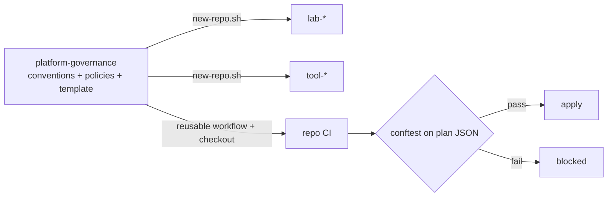

# platform-governance

Status: active

The single source of truth for how every repo in this account is built: conventions, policy-as-code, reusable CI, and a template that new repos start from. Written because most code here is AI-assisted, and AI assistance only stays safe inside a hard, automated frame.

## What's inside

| Path | Purpose |
|---|---|
| [`docs/conventions.md`](docs/conventions.md) | Numbered rules (REPO-, GIT-, TF-, K8S-, SEC-, DOC-, COST-) with how each is enforced |
| [`docs/ai-usage.md`](docs/ai-usage.md) | Rules and metrics for working with AI agents |
| [`docs/adr/`](docs/adr/) | Why the conventions are what they are |
| `policies/terraform/` | Conftest/OPA policies run against the plan JSON (naming, tags, regions, public access, destroy guard) |
| `.github/workflows/terraform-ci.yml` | Reusable pipeline: fmt, validate, tflint, checkov, plan + policy gate |
| `template/` | What a new repo starts with: `AGENTS.md`, Copilot instructions, PR template, CI, Makefile, pre-commit |
| `scripts/new-repo.sh` | Creates a repo from the template, optionally pushes it with branch protection |
| `scripts/audit-repo.sh` | Checks an existing repo against the structural rules and reports version drift |

## Use it

```bash
# New repo
scripts/new-repo.sh lab-elastic-stack "Elastic on AKS as an opt-in stack" --push

# Check an existing repo (e.g. azure-devops-lab)
scripts/audit-repo.sh ~/dev/azure-devops-lab

# Test the policies
make test
```

Generated repos get `.governance-version`. When conventions change, bump `VERSION`; `audit-repo.sh` warns on drift.

## Design



Principles:

1. **Enforce, don't remind.** Every rule names its check. Rules with no check are flagged `PR` and kept few.
2. **Policy between plan and apply.** The agent cannot bypass it.
3. **Small and boring.** Plain bash, OPA, and GitHub Actions. No platform to run.
4. **Dogfood.** This repo runs its own audit and tests in CI.

## Requirements

This repo should stay **public**: repo CI checks it out to read policies and scripts, and `GITHUB_TOKEN` cannot read other private repos.

## Cost

0 EUR. No infrastructure.

## Roadmap

- [x] Conventions, template, new-repo and audit scripts
- [x] Terraform policies (tags, naming, regions, public access, stateful destroy)
- [ ] Push to GitHub, set Actions access, retrofit `azure-devops-lab` (run `audit-repo.sh`, fix findings)
- [ ] Kubernetes policies (Kyverno or conftest on manifests): requests/limits, no `latest`
- [ ] OIDC federated credential bootstrap script for new Azure repos (TF-8)
- [ ] Monthly metrics script (review wait, CI first-pass rate, rework)
- [ ] Release tags (`v1`) so repos pin the reusable workflow instead of `@main`

## Rotations

None.
